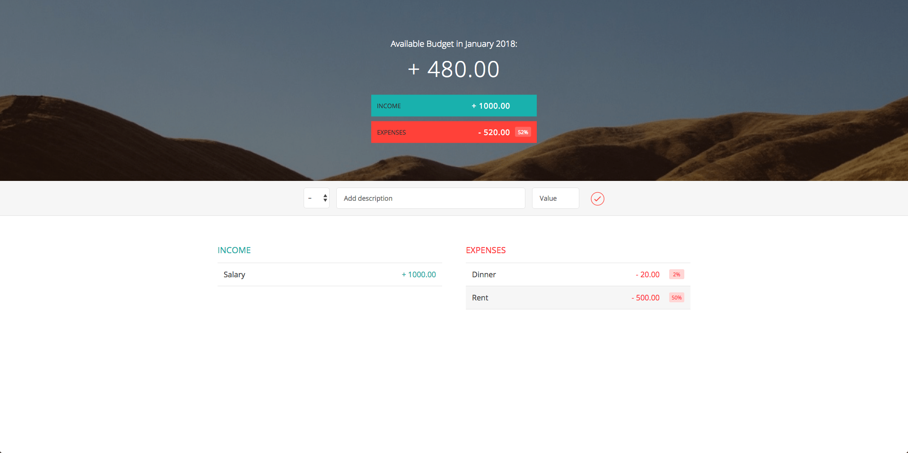

# Budget Calculator

This is a Budget Calculator written in JavaScript. Based on parameters like income and expenses, it calculates your savings and expenditures.

Live Demo: https://caizhenchao.me/Budget
